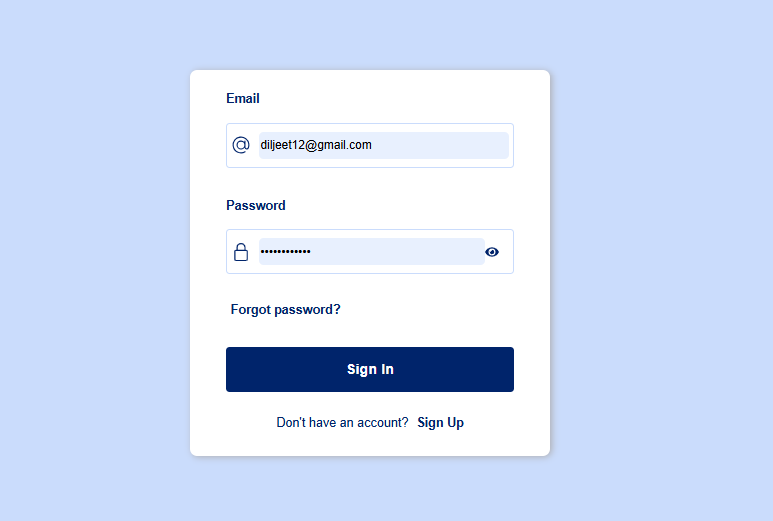
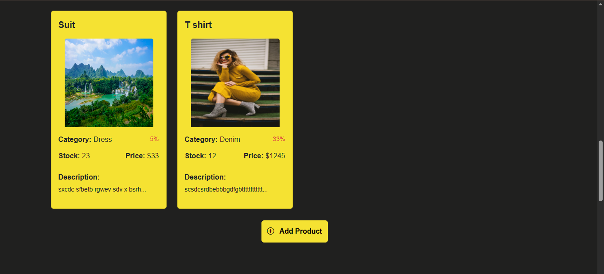
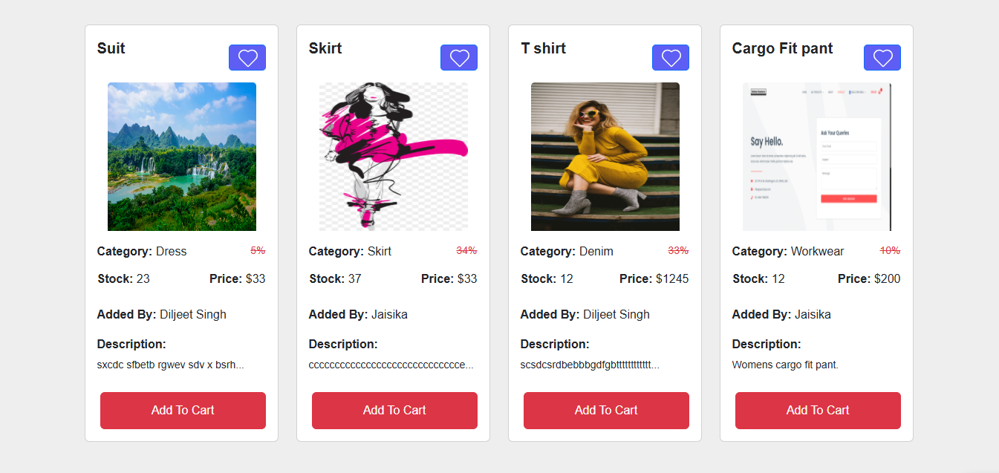
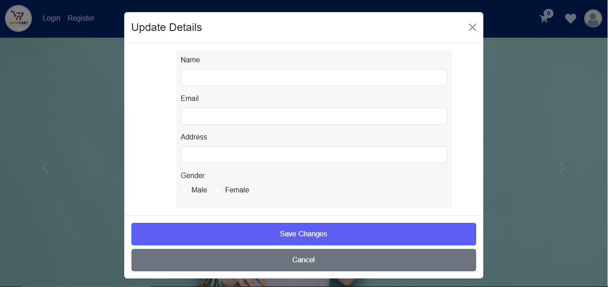
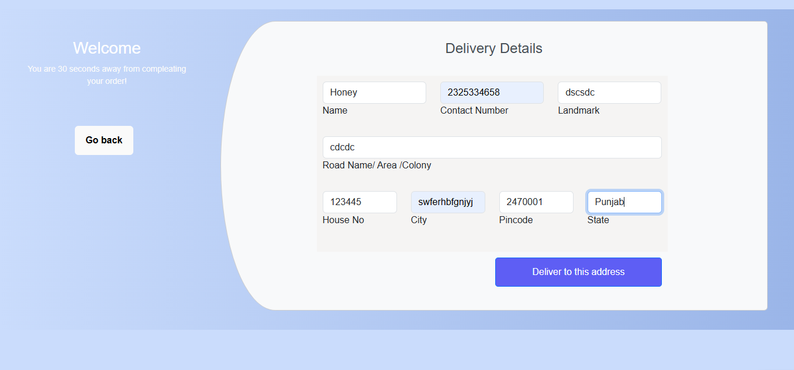
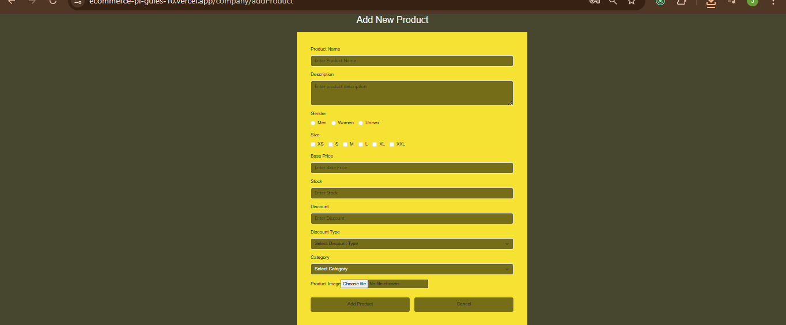
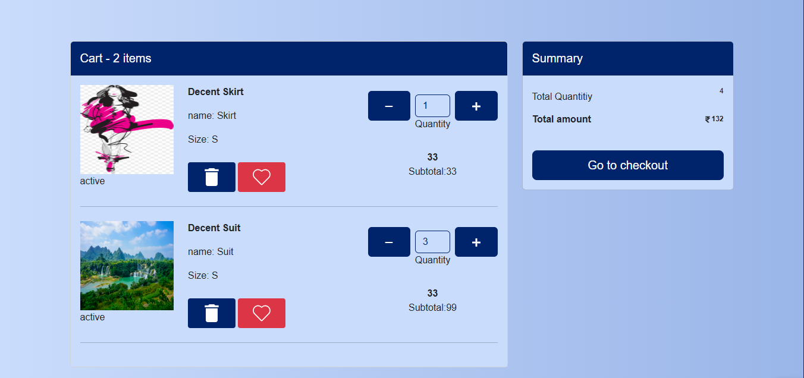

# 🛒 E-Commerce Platform

A fully-featured multi-role e-commerce web application with dedicated panels for **Admin**, **Companies**, and **Users**. The project is built using **ReactJS with Vite**, **Node.js**, and **Bootstrap**, and is deployed on **Vercel** and **Render**.

---

## 🌐 Live Demo

- **Frontend (React + Vite):** [https://ecommerce-pi-gules-10.vercel.app/](https://ecommerce-pi-gules-10.vercel.app/)
- **Backend (Node.js):** [https://ecommerce-8hy6.onrender.com](https://ecommerce-8hy6.onrender.com)

---

## 🧩 Features

### 👤 User Panel
- Users can browse products without login.
- Login required to **add items to cart**.
- After login, users are redirected to their **dashboard**.
- Authentication is handled via **protected routes**.

### 🏢 Company Panel
- Companies have their **own login and dashboard**.
- Can **add/manage products** visible only to that company.
- Dashboard is protected and personalized.

### 🔐 Admin Panel
- Admin has access to all **user and company details**.
- Can monitor system-wide activities and users.
- Accessible only to admin via **secured authentication routes**.

---

## 🔐 Authentication & Protected Routes

- **JWT-based authentication** is implemented across all panels.
- Unauthorized users are redirected if they attempt to access protected routes.
- Role-based access control ensures users only see what they're allowed to.

## 🚀 Features

- Three-panel role-based architecture (Admin, Company, User)
- Login authentication for users and companies
- Dynamic product listing and cart functionality
- Secure route protection based on user roles
- Clean UI with Bootstrap styling
- Company-specific product management

## ⚙️ Tech Stack

- **Frontend:**
  - React.js (with Vite)
  - Bootstrap 5

- **Backend:**
  - Node.js

Install Dependencies
cd Frontend
npm install
npm run dev

For backend (Node.js)
cd Backend
npm install
npm start

